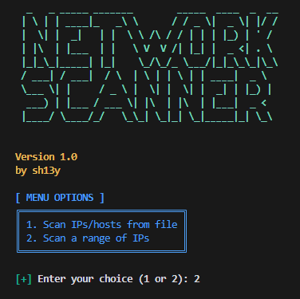

# Network Scanner

## Description
Network Scanner is a simple tool to check the availability of hosts in a network. It allows you to scan a list of IPs from a file or a range of IPs, checking if they are active on a specified port.

## Features
- Scan IPs/hosts from a file.
- Scan a range of IPs.
- Specify the port to check (default is 80).
- User-friendly command line interface with colored output.

## Requirements
- Python 3.x
- `colorama` library (install using `pip install colorama`)

## Usage
1. Run the script:
   ```bash
   python network_scanner.py
   ```
2. Choose an option to scan from a file or a range of IPs.
3. Follow the prompts to enter the necessary information.

## Preview


## A Little Humor
Why did the computer go to therapy?  
Because it had too many connections and couldn't find its IP!

Happy scanning! 😄
